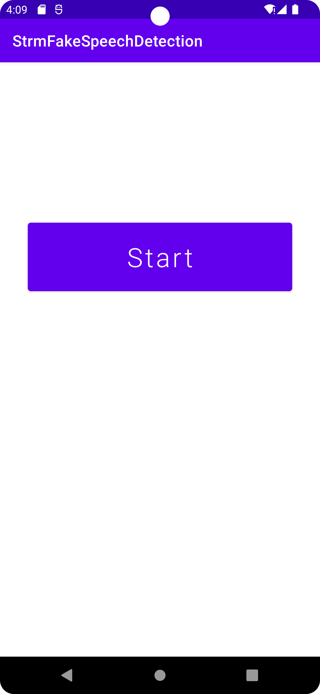
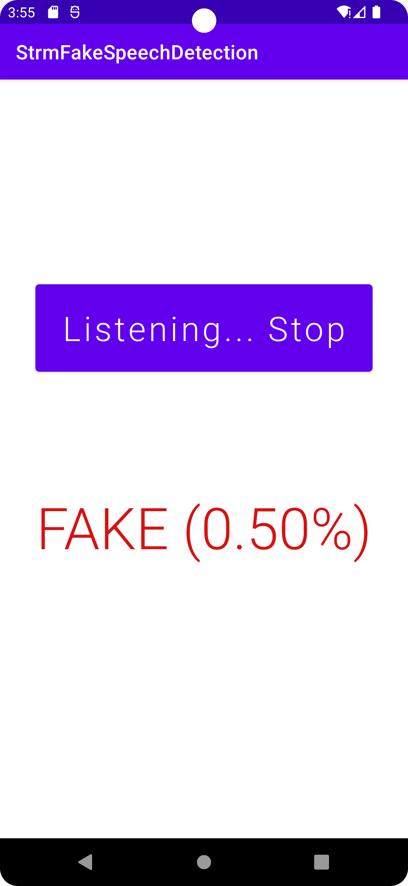

# Streaming Fake Speech Detection on Android with Distill-SSL-AASIST-L Model

## Introduction

In the Fake Speech Detection Android [StreamingFakeSpeechDetection app](https://github.com/hungdinhxuan/StreamingFakeSpeechDetection), we showed how to use the Distill-SSL-AASIST-L model on an Android demo app to perform non-continuous fake speech detection.

## Prerequisites

- Android Pytorch library org.pytorch:pytorch_android_lite:2.1.0
- Android Studio 4.0.1 or later

## Quick Start Build and run with Android Studio

Start Android Studio, open the project located in `StreamingFakeSpeechDetection`, build and run the app on an Android device (not an emulator). After the app runs, tap the Start button and start saying something. Some example detection results are:

