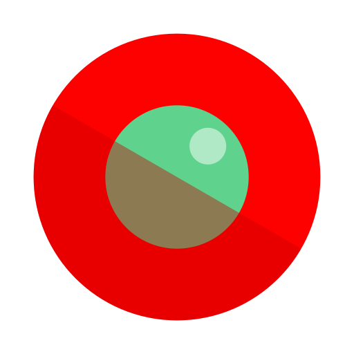
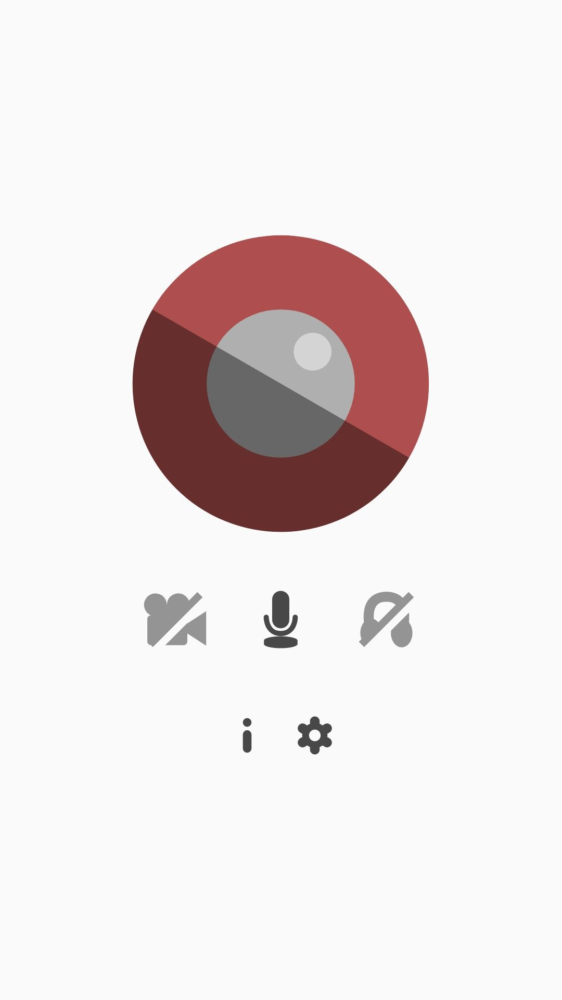
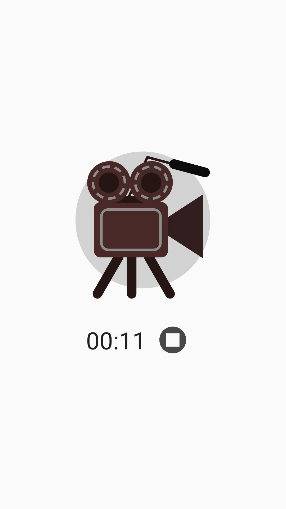

English | [עברית](README.he.md)



# DroidRec
### An open-source Android screen recorder.

*Audio Playback recording requires Android 10 or later. No Root needed.*

*(**WARNING**: Some device vendors may not allow recording some Audio Playback sources, or even recording it at all)*

 

[](https://f-droid.org/packages/com.yakovlevegor.DroidRec/)
[](https://play.google.com/store/apps/details?id=com.yakovlevegor.DroidRec)

Or download the apk from [the release section](https://github.com/egorolegovichyakovlev/DroidRec/releases).

## Building

To build this app, run **gradle assembleRelease**

To sign the build, first generate your keystore with `keytool -genkeypair -keystore mykey.keystore -validity 365000 -keysize 4096 -keyalg RSA` and place it in this folder under `signature.keystore` name.
(**Note**: Run keytool with the same or older Java version on which you are going to build the application)

Then you can run **quicksign.bash** with path to your Android SDK "build-tools/*version*" as an *optional* argument(if build tools aren't in your $PATH).

Example: `./quicksign.bash $ANDROID_HOME/build-tools/33.0.0`


## ! Urgent !

I don't currently accept any donations for DroidRec, but I'm asking you to:
### [Help a disabled queer person from becoming homeless in Wisconsin](https://plush.city/@mynameistillian/110984654277419627)
They require **immediate help** to find stable housing.

## License

#### The Unlicense
```
This is free and unencumbered software released into the public domain.

Anyone is free to copy, modify, publish, use, compile, sell, or
distribute this software, either in source code form or as a compiled
binary, for any purpose, commercial or non-commercial, and by any
means.

In jurisdictions that recognize copyright laws, the author or authors
of this software dedicate any and all copyright interest in the
software to the public domain. We make this dedication for the benefit
of the public at large and to the detriment of our heirs and
successors. We intend this dedication to be an overt act of
relinquishment in perpetuity of all present and future rights to this
software under copyright law.

THE SOFTWARE IS PROVIDED "AS IS", WITHOUT WARRANTY OF ANY KIND,
EXPRESS OR IMPLIED, INCLUDING BUT NOT LIMITED TO THE WARRANTIES OF
MERCHANTABILITY, FITNESS FOR A PARTICULAR PURPOSE AND NONINFRINGEMENT.
IN NO EVENT SHALL THE AUTHORS BE LIABLE FOR ANY CLAIM, DAMAGES OR
OTHER LIABILITY, WHETHER IN AN ACTION OF CONTRACT, TORT OR OTHERWISE,
ARISING FROM, OUT OF OR IN CONNECTION WITH THE SOFTWARE OR THE USE OR
OTHER DEALINGS IN THE SOFTWARE.

For more information, please refer to <http://unlicense.org/>
```
